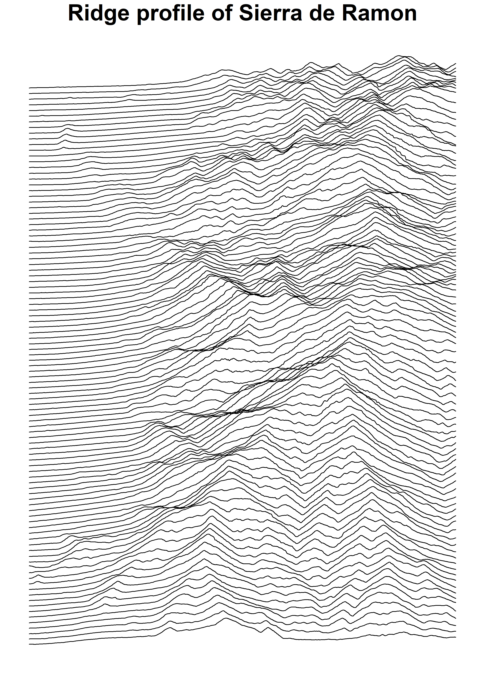
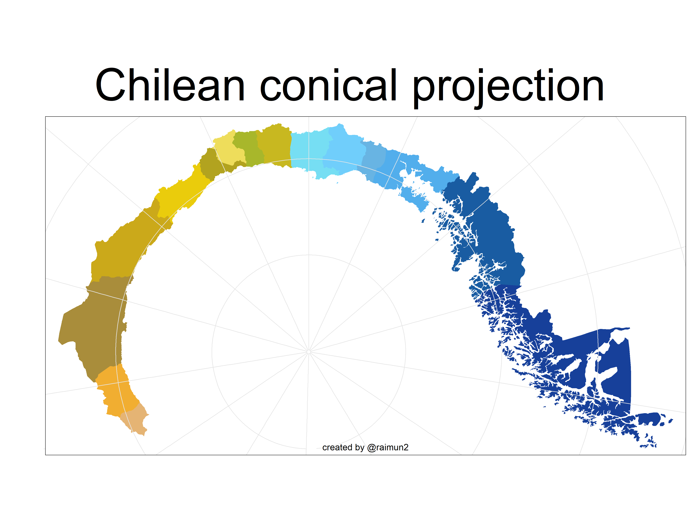

30 Day Map Challenge
================
@raimun2

## 2021

This is the gallery of all my posts during 2021 \#30DayMapChallenge,
also shared through [twitter](https://www.twitter.com/raimun2)

[day01: points](R/day01_points.R) [day02:
lines](R/day02_lines.R) [day03:
polygons](R/day03_polygons.R) [day04:
hexagons](R/day04_hexagons.R) [day05:
openstreetmap](R/day05_openstreetmap.R)
[day06: red](R/day06_red.R)
[day07: green](R/day07_green.R)
[day08: blue](R/day08_blue.R)
[day09: monochrome](R/day09_monochrome.R)
[day10: raster](R/day10_raster.R)
[day11: 3d](R/day11_3d.R)
[day12: population](R/day12_population.R)
[day13:
naturalearth](R/day13_naturalearth.R)
[day14: newtool](R/day14_newtool.R)
[day16: urbanrural](R/day16_urbanrural.R)
[day17: land](R/day17_land.R)
[day18: water](R/day18_water.R)
[day19: islands](R/day19_islands.R)
[day20: movement](R/day20_movement.R)
[day21: elevation](R/day21_elevation.R)
[day22:
boundaries](R/day22_boundaries.R)
[day23: GHSL](R/day23_GHSL.R)
[day24: historical](R/day24_historical.R)
[day26:
choropleth](R/day26_choropleth.R)
[day27: heatmap](R/day27_heatmap.R)
[day28: notflat](R/day28_notflat.R)
[day29: null](R/day29_null.R)
[day30: meta](R/day30_meta.R)

