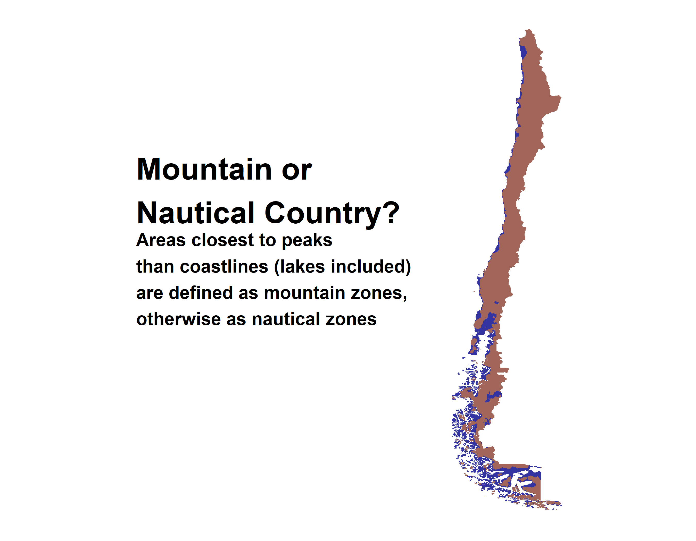

30 Day Map Challenge
================

This is the gallery of all my posts during 2021
[\#30DayMapChallenge](https://github.com/tjukanovt/30DayMapChallenge),
also shared through my [twitter
account](https://www.twitter.com/raimun2)

Most of my posts were developed in R programming language, except for
day 25 (map without a computer)

<h2>

[day01: points](R/day01_points.R)

</h2>

<h2>

[day02: lines](R/day02_lines.R)

</h2>

<h2>

[day03: polygons](R/day03_polygons.R)

</h2>

<h2>

[day04: hexagons](R/day04_hexagons.R)

</h2>

<h2>

[day05: openstreetmap](R/day05_openstreetmap.R)

</h2>

<h2>

[day06: red](R/day06_red.R)

</h2>

<h2>

[day07: green](R/day07_green.R)

</h2>

<h2>

[day08: blue](R/day08_blue.R)

</h2>

<h2>

[day09: monochrome](R/day09_monochrome.R)

</h2>

<h2>

[day10: raster](R/day10_raster.R)

</h2>

<h2>

[day11: 3d](R/day11_3d.R)

</h2>

<h2>

[day12: population](R/day12_population.R)

</h2>

<h2>

[day13: naturalearth](R/day13_naturalearth.R)

</h2>

<h2>

[day14: newtool](R/day14_newtool.R)

</h2>

<h2>

[day16: urbanrural](R/day16_urbanrural.R)

</h2>

<h2>

[day17: land](R/day17_land.R)

</h2>

<h2>

[day18: water](R/day18_water.R)

</h2>

<h2>

[day19: islands](R/day19_islands.R)

</h2>

<h2>

[day20: movement](R/day20_movement.R)

</h2>

<h2>

[day21: elevation](R/day21_elevation.R)

</h2>

<h2>

[day22: boundaries](R/day22_boundaries.R)

</h2>

<h2>

[day23: GHSL](R/day23_GHSL.R)

</h2>

<h2>

[day24: historical](R/day24_historical.R)

</h2>

<h2>

[day26: choropleth](R/day26_choropleth.R)

</h2>

<h2>

[day27: heatmap](R/day27_heatmap.R)

</h2>

<h2>

[day28: notflat](R/day28_notflat.R)

</h2>

<h2>

[day29: null](R/day29_null.R)

</h2>

<h2>

[day30: meta](R/day30_meta.R)

</h2>

